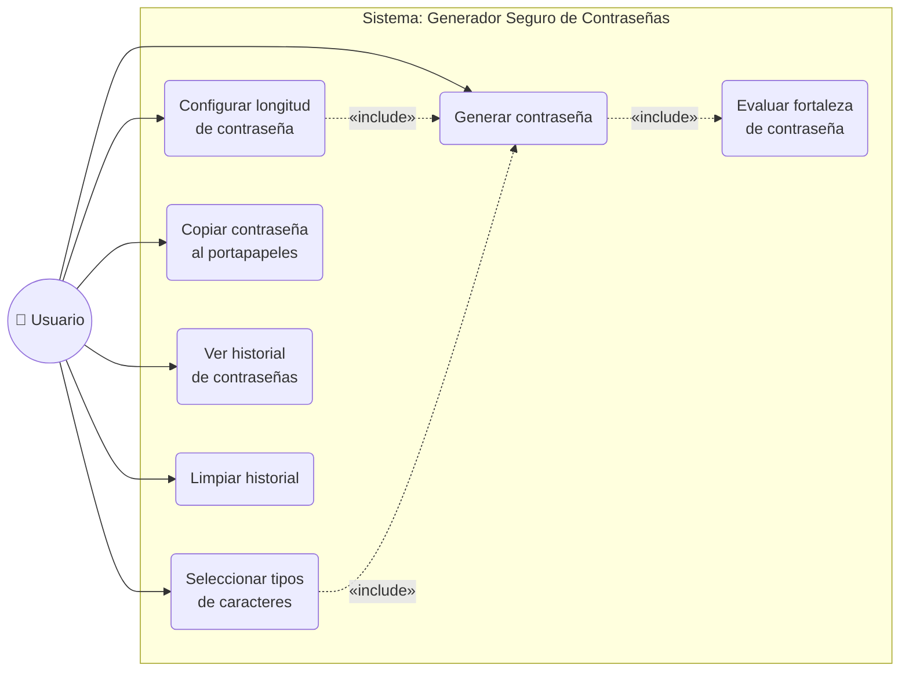
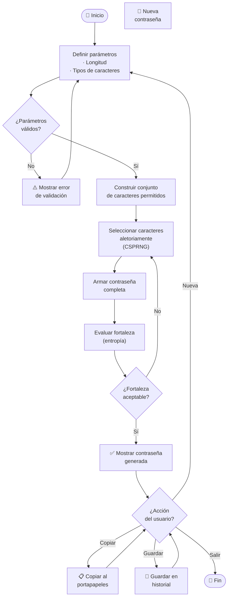
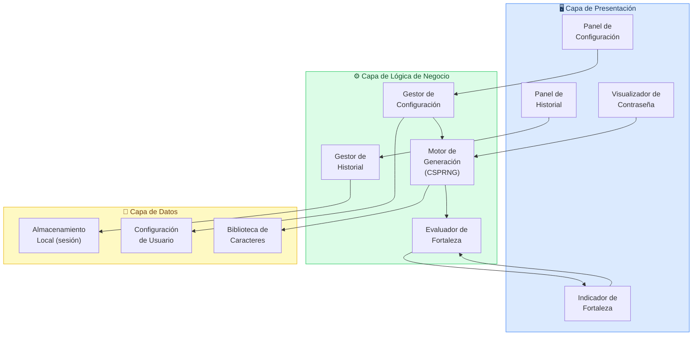

# Diagramas Mermaid — Generador Seguro de Contraseñas

> Exporta cada diagrama como PNG y guárdalo en la carpeta `imagenes/`
> con el nombre exacto indicado. Luego compila el `.tex` normalmente.

---

## Diagrama 1: Casos de Uso
**Archivo destino:** `imagenes/diagrama_casos_uso.png`



---

## Diagrama 2: Flujo del Proceso
**Archivo destino:** `imagenes/diagrama_flujo.png`



---

## Diagrama 3: Arquitectura del Sistema
**Archivo destino:** `imagenes/diagrama_arquitectura.png`



---

## Instrucciones de exportación

1. Ve a [mermaid.live](https://mermaid.live) (editor online gratuito).
2. Pega el código de **cada diagrama** (sin los backticks ` ``` `).
3. Haz clic en **Download PNG** (esquina superior derecha).
4. Renombra el archivo con el nombre exacto indicado arriba.
5. Crea la carpeta `imagenes/` junto a tu archivo `.tex` y mueve los PNG ahí.
6. Compila con `pdflatex generador_contrasenas.tex`.
```
estructura de carpetas esperada:
├── generador_contrasenas.tex
└── imagenes/
    ├── diagrama_casos_uso.png
    ├── diagrama_flujo.png
    └── diagrama_arquitectura.png
```
